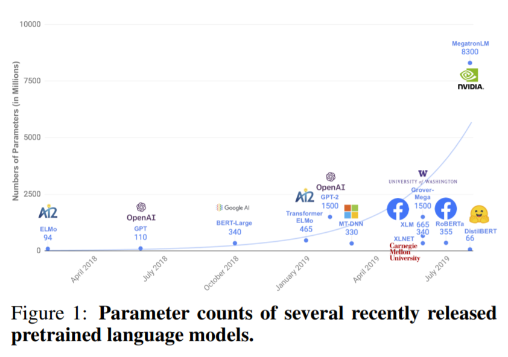
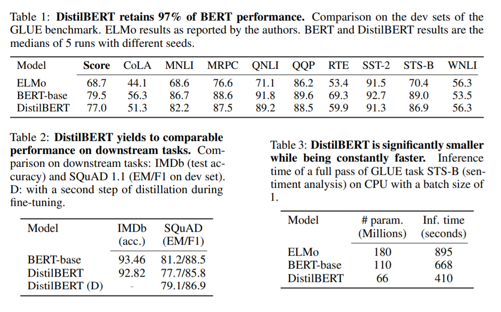

# DistilBERT, a distilled version of BERT: smaller, faster, cheaper and lighter

[논문](https://arxiv.org/abs/1910.01108)

## Abstract

NLP 분야에서 Large-scale pre-trained model의 전이 학습이 점점 보편화됨 하지만 다양한 제약이 존재하는 환경에서 이렇게 큰 모델을 사용하기는 힘듬

=>DistilBert라는 general purpose language representation model제안,

BERT 크기를 40% 정도 줄이고 60% 빠르게 연산하면서 성능은 97%유지함

## 1. Introduction

최근 pretrining에 사용되는 parameter의 수

## 2. Knowledge distillation

Knowledge distillation은 larger model로부터 compact model을 만들어내는 방법

=> near-zero인 확률도 학습하기 때문에 작은 모델을 바로 학습하는 것보다 의미가 있음

distillation loss =>  (Lce=∑iti∗log(si)Lce=∑iti∗log⁡(si), ti

final training loss는 distillation loss Lce와 BERT에서 사용한 Lmlm의 linear combination

## 3. DistilBert: a distilled version of BERT

student layer의 구조는 BERT랑 똑같은데 token type embedding이랑 pooler layer가 제거됨 & transformer block을 반으로 줄임. 그리고 initialization은 teacher의 레이어 두 개당 하나를 취함

