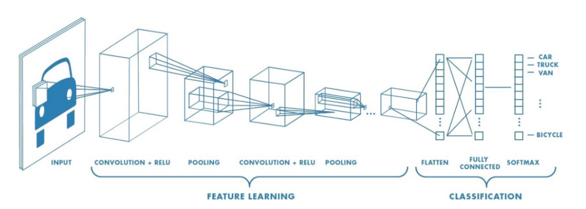
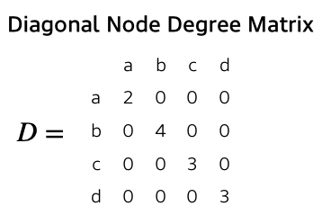

# Graph Convolutional Networks

- 일반적으로 CNN을 사용하는 네트워크에서는 convolution 연산과 pooling 연산을 반복적으로 수행한다.

- convolution은 각각의 구역으로부터 정보를 추출하는 작업,  pooling 연산은 추출된 정보 중에 중요한 정보만 남기는 작업이라고 이해할 수 있다.

- GCN은 그래프에서 convolution filter와 같은 효과를 통해 그리드 형태가 아닌 데이터에서도 효과적으로 feature extraction 및 학습이 가능하도록 하는 것이 목표이다.
- GCN은 필터를 그래프에 대해 통과시켜 그래프 내에서 중요한 노드와 엣지로부터 정보를 취합한다.
- convolution은 지역, 인접 정보를 취합해 feature를 고도화하는 과정
- CNN과 차이점이라면 CNN은 특정 위치의 지역적인 정보를 취합하는 것이고, GCN은 특정 노드와 연결되어 있는 노드의 정보를 취합하는 것이다.
- GCN, CNN 모두 정보를 취합하는 방법(W)은 한 layer의 모든 위치 또는 노드에 공유된다.

## GCN Formulation

Graph G = (V, E)가 주어졌을 때, GCN은 다음을 input으로 받는다.

- input feature matrix: _n x d_ size, 여기서 n은 노드의 개수, d는 embedding dimension
- adjency matrix: _n x n_ size, 그래프의 인접 행렬

GCN의 i번째 hidden layer는 다음과 같이 표현이 가능하다.
$$
H^i = f(H^{i-1}, A)\quad where \;H^0 = X,\; f = propagation
$$

propagation rule인 f를 어떻게 정하느냐에 따라 다양한 GCN이 파생되어 나올 수 있다.

CNN에서는 앞단의 layer에서는 기본적인 feature를 추출하고, 뒷 layer로 갈수록 추상적인 feature를 잘 추출해내는 것처럼 GCN도 i가 커질 수록 추상적인 feature를 잘 추출해낸다.

## Propagation rule

가장 간단한 Propagation rule은 다음 식을 적용하는 것이다.
$$
f(H^i, A) = \displaystyle\sigma(AH^iW^i)\\
where \; \displaystyle\sigma \; is \; a \;non-linear \; activation \; function 
$$

$$
size\; of \; W^i = d^i \times d^{i+1}\; where \; d^i \; is \; i-th\;embedding\;dimension
$$

$$
H^i \times W^i
$$
연산의 의미는
$$
d^i-dimension\;features => d^{i+1}-dimesion\; features
$$

이때의 문제점

1. adj 행렬의 (i, i) 성분에 대해서 0이기 때문에 자기 자신의 feature은 특성을 추출할 때 반영되지 않음
2. node의 연결성에 따라 gradient 차이가 크다.(연결이 많이 된 노드는 gradient exploding, 연결이 적은 노드는 gradient vanish 발생)

이를 해결하기 위해서 두 가지 trick을 사용한다.

1. Self-loop
   - adj 행렬의 (i, i) 성분을 1로 채움 => 자기 자신의 feature 고려 가능
2. Normalization feature representation
   - node 연결성에 대해 normalize 수행함으로써 back-propagation 안정화

$$
f(H^i, A)=\displaystyle\sigma(D^{-\frac{1}{2}}AD^{-\frac{1}{2}}H^iW^i)\; where\;D\;is\;diagonal\;node\;degree \;matrix,
$$

ex)

