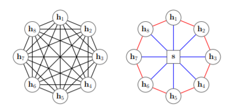
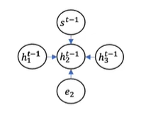

# Sparse Attention

## 기존의 Self-Attention의 문제점

- Complexity 문장이 길어지면 병목현상이 발생 O(T^2 * D) T = 문장길이, D = hidden dimension
- Structural Prior: Input에 대한 bias가 없다(장점이면서 단점)

## 이를 해소하기 위한 노력

- Sparse Attention
- Linearized attention
- Prototype and Memory compression
- Low-Rank Attention
- Attention with Prior
- Improved Multi-head Mechanism

## Vanilla Transformer Attention Matrix는 Sparse한가

- Attention은 훈련 뒤에는 볼 대상만 보게 된다.
- 애초에 Structural Bias를 부여하여, Query-Key Pair 개수를 제한하자

## Sparse Attention 공통점

__공통 주장__

- Computational Cost: 문장이 길어질수록 Attention에 필요한 비용이 크다
  - Input Length에 Quadratic하게 증가하는 비용 대신에, Linear하게 증가하도록 하는 것이 목적
  - O(n^2) => O(n)
- Long Range Dependency: 긴 문장에는 Transformer를 적용하기 힘들다(+ Cost문제, 보통 512로 알고 있음)
  - Global Attention을 통해 Long Range Dependency 해소

__Sparse Attention 효과__

- 비용/ Dependency를 감소 시키면 512 token보다 더 긴 문장을 input으로 활용할 수 있다.
- Input 문장을 길게 만들면, Downstream Task에 사용되는 단서가 많아진다
- Downstream task로 QA & 문서 요약이 많이 사용
- Sparse Attention은 Long Input이 사용되는 Encoder에 적용된다.

## Position-based Sparse Attention

__Atomic Sparse Attention__

__Atomic Sparse Attention의 종류__

- Global Attention
  - Attention의 Long Range Dependency를 완화하기 위해, Global Node를 설정하여 모든 노드를 Attend
- Band Attention(Sliding Window Attention/ Local Attention)
  - 언어의 Localty를 반영하기 위하여, 근접한 이웃 노드들에 대해서만 Attend
- Dilated Attention
  - Dilated CNN과 같이 Computation은 같지만 더 넓은 Receptive Field를 위해 한 칸씩 띄운 Band Attention
- Random Attention
  - 인접하지 않은 단어들에 대한 상호작용을 반영하기 위하여 각 Query에서 랜덤으로 Attend
- Block Local Attention
  - 문장을 여러 non-overlapping query block으로 나누고 해당 Block내에서만 Attention 적용

__Atomic Sparse Attention의 Combination__

- Star-Transformer: Band Attention + Global-Node Attention
- Longformer: Band Attention + Dilated Attention + Global-Node Attention
- Extended Transformer Construction: Band Attention + Global-Node Attention
- BigBird: Band Attention + Global- Node Attention + Random Attention

__Star Transformer__

- Global Attention > Radical Connection: Relay Node와 Satellite Node간의 연결 => Document Representation
- Band Attention > Ring Connection: Satellite Node와 Satellite Node간의 연결
- Satellite Node의 Update 절차
  - 주변의 Satellite Node, embedding Node, Relay Node를 모아서 Multi attention 진행

​		

- Implications
  - Band Attention과 Global Attention이 상호작용
  - Originatl Transformer Complexity: O(n^2 * d)
  - Star Transformer (ring conn): O(5nd)
  - Star Transformer (radical conn): O(nd)
  - Relay Node를 활용한 분류 Task 진행

__Longformer__

- Long Sequence를 다루기 위한 Transformer(512 token 제한을 벗어나고자 함)
- LongFormer Attention을 통해 Self-Attention 보완
- Transformer의 Encoder 성능 향상 용이 아닌 Seq2Seq 성능 향상 용도

- Local Attention
  - Lower Layer: Local information => Sliding WIndow Attention (낮은 층에서는 문장의 지엽적인 정보를 인코딩)
  - Higher Layer: Higher-level representation => Dilated Sliding Window Attention (높은 층에서는 문장의 더 넓은 정보를 인코딩)
- Global Attention
  - Sliding Window와 Dilated Sliding Window Attention은 [CLS] Token과 같이 Task Specific Representation을 구성할 수 없다
  - [CLS] token과 같이 단 하나만 사용하는 것이 아니라, 선택된 위치에 복수 개 삽입

__ETC: Extended Transformer Construction__

- Key Ideas
  - Global-Local Attention
    - Global Node를 통ㅇ해 전체 문장의 Attention을 계산,
    - Local Attention을 통해 인접 Token들 간의 Attention 계산
  - Relative Postion Representation
    - 문서 내 문장 내에서 단어의 상대적 위치를 Position Encoding에 반영한다.

__BigBird__

- Question

  - Sparse Attention이 원래 Attention의 성능과 동일할 수 있는가
  - 더 적은 Inner-product로 full quadratic self-attention의 성능을 보존할 수 있는가

  => Sparsity를 생성하면서도 최대한 Full Attention Model과 유사한 성능을 만들고자 함

- Random Attention(Random Block) ~ Graph Sparsification Problem

  - Graph Theory에서 Random Graph는 Complete Graph를 잘 근사하기 때문에, Full Attention Graph를 Random Graph로 치환해도 문제가 없다.

- Local Attention(Local Window)

  - Linguistic Structure를 반영하기 위해 인접한 Token에 대한 Attention이 필요하다.

=> Random Blocks와 Local Window만으로는 BERT에 상응하는 성능 달성 x

- Global Attention (Global Tokens)
  - BIGBIRD-ITC(기존 Corpus에 존재하는 Token들 중 Global Token을 지정)
  - "global" 이라는 특정 Token을 사용
  - BIGBIRD-ETC(문장에 [CLS]와 같은 Global Token 추가)

- Result

  - BigBird의 Sparse Attention으로 더 긴 길이의 문장을 Transformer에 적용 가능 => DownStream Task의 성능
  - Basic Masked Language Modeling을 통해 더 좋은 Representation을 학습할 수 있었는지
  - QA Task에서 긴 문장의 Input이 정답을 유도할 수 있는 더 많은 Evidence를 제공하는지
  - 문서 요약에서 512 token보다 더 긴 문장의 효과를 볼 수 있는지
  - 를 실험을 통해 보이고자 함

- Encoder-Decoder Task Setup

  - Sparse Attention을 Encoder에만 적용

  - Encoder Input이 Decoder Output보다 높은 수준으로 차이가 있기 때문에, Decoder에서는 Full Attention을 사용

    (Input Median Len: 3000이상 / Decoder Median Len: 200)

- Ref: https://huggingface.co/blog/big-bird

__Extended Sparse Attention__

BP-Transformer

- Binary Partitioning(문장을 재귀적으로 나누어 단일 Token이 될 때까지 나눔)을 통해 문장을 Graph의 형태로 나타냄

- Graph Self Attention을 통해 Representation을 Update

Edge Construction

- Affilated Edges: Span Node에 대하여 포함되어 있는 Token들과 모두 연결
- Contextual Edges: 모든 이웃 Token을 Edge로 연결하지 않고, 상위 Span Node들을 연결
- 파라미터 k를 통해 Layer별 몇 개의 노드와 연결할 지 결정

## Content-based Sparse Attention

위치 기반이 아닌, Token의 내용 기반

__Content Based Sparse Attention의 목적__

- 모든 Query-Key Pair에 대하여 내적을 실시하지 않고, 최대 내적 값을 갖는 Key값 탐색
- 가장 유사한 Content들 간의 Attention으로 Sparse Attention을 달성하고자 함

- 유사한 Content Search Algorithm: Maximum Inner Product Search(MIPS) problem
  $$
  MIPS = argmax_{k\in K}(q^Tk)
  $$
  
- (Exact) MIPS를 근사하기 위한 여러 전략이 있으며, Transformer에서는 
  - Locality-Sensitive Hashing(LSH):Reformer
  - Nearest Neighbor Search(NNS): Routing Transformer

__Reformer__

 : The Efficient Transformer => Transformer의 극한의 효율을 달성하고자 한다.

- Attention Layer 개선(필요없는 연결 제거, 문장길이)
  - 쓸모 없는 Attention을 줄일 수 있또록  LSH Attention 적용
- Residual Block 개선(메모리 저장 구조 변경, 모델 깊이)
  - 중간 값 저장없이 역전파 할 수 있는 Reversible Netowrk 구조 적용
- Feedforward Layer개선(단계별로 메모리 사용, 모델 넓이)
  - 계산하는 단위를 나누어 메모리를 사용할 수 있는 Chunking 적용

__Routing Transformer__

- Query가 Attention을 구할 대상인 Key들에게 Routed(연결)되어 대상이 제한
- Maximum Inner Product Search(MIPS)를 근사하려는 목적에서 LSH보다 spherical k-means가 더 우수

