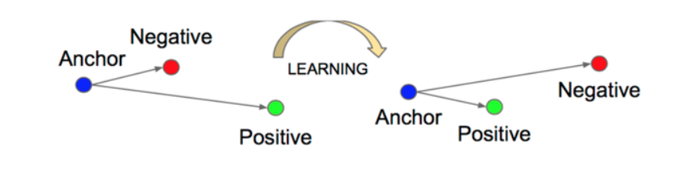

# Triplet Loss

### 개요

Deep learning based Face recognition에서 두 가지 기술 발전 방향 중 verification loss function에 해당, 무작위 데이터셋에서 positive pair, negative pair를 sampling한 후 positive는 가깝게 negative는 멀리 배치하는 방법

### 설명

Anchor, Positive, Negative 세 가지 input을 받는다

식

d:거리함수, a:anchor, p:positive, n:negative

L = max(d(a, p)) - d(a, n) + margin, 0)

